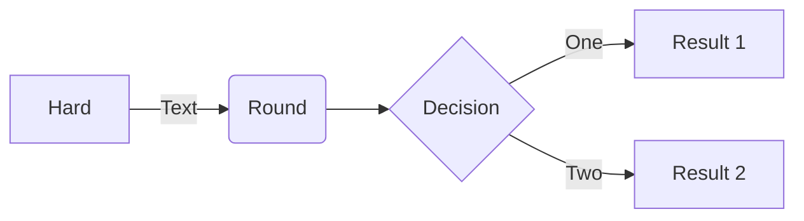

# Titulo nivel 1
## Titulo nivel 2
### Titulo nivel 3
#### Titulo nivel 4
##### Titulo nivel 5
###### Titulo nivel 6

Otro titulo nivel 1
===================

Otro titulo nivel 2
---

Para escribir parrafos, 
solo escribo texto y más texto.

Para separar párrafos, 
simplemente dejo una linea en blanco. \
Si este linea quiero que empiece en otro renglón del mismo párrafo.

Formatos de textos:

Si quiero poner algo en *enfasis*

Si quiero poner algo **remarcado**

Si quiero poner algo ***enfatizado y remarcado***

Si quiero tachar ~~algo~~

Si quiero que algo aparezca como `codigo`

Puedo meter mucho código:

        nombre: "http"

```yaml
    - name: Abrir el puerto 80
      include_role:
        name: abrir-puertos
      vars:
        puerto: 80
        protocolo: tcp
        nombre: "http"
```

# Citas

> Cualquier IMBECIL peude escribir un programa que entienda una computadora. Un buen programador escribe programas que otros humanos puedan entender: Martin Fowler.

## Puedo crear listas:

### Ordenadas:

1. Item 1
2. Item 2
3. Item 3
4. Item 4

##### Otra sintaxis

1) Item 1
1) Item 2
1) Item 3
1) Item 4
   1) Item 1
   1) Item 2
   1) Item 3
   1) Item 4


### No ordenadas:

- Item 1
- Item 2
- Item 3
- Item 4

##### Otra sintaxis

+ Item 1
+ Item 2
+ Item 3
+ Item 4
   * Item 1
   * Item 2
   * Item 3
   * Item 4

## Tablas

| Columna 1 | Columna 2              |
| :-------: | ---------------------- |
| Dato 1    | más info del dato 1    |
| Dato 2    | más info del dato 2    |


## Enlaces:

Ir a la página de [la vanguardia](http://lavanguardia.es)

## Imágenes


## Charts

